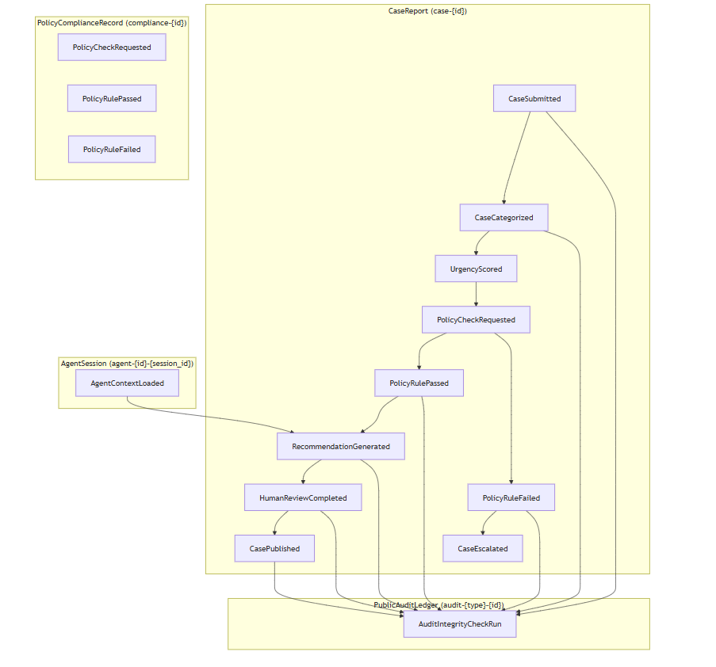

# Project: AI Decision Audit Ledger for Transparent & Accountable Civic AI Systems
**Tech Stack:** PostgreSQL (psycopg3), Event Sourcing, CQRS, Hash-Chain Integrity, Optimistic Concurrency Control

## 1. EDA vs ES
**EDA (Event-Driven Architecture):**
LangChain callback traces are examples of EDA. They capture ephemeral communication between services—events flowing asynchronously across components. These traces are useful for debugging but are not durable; if a callback is lost, the system continues without a permanent record.
EDA is about communication, not storage.

**ES (Event Sourcing):**
In the Civic Ledger, every state transition is stored as an immutable event in PostgreSQL. Losing an event here means losing a citizen’s case decision record. That’s not just a dropped message—it’s an accountability gap.
ES is about state storage and truth persistence.

**Architecture:**
Designing with event sourcing means:

- Every agent action (CaseSubmitted, PolicyCheckRequested, etc.) is persisted.

- Hash-chain integrity ensures tamper-evidence.

- Reproducibility: any case can be replayed from its event stream.

- Auditability: regulators can verify that no decision was fabricated or erased.

## 2. Aggregates

**CaseReport (case-{id}):**
Stream of all events tied to a citizen complaint. Boundary: one case per citizen submission.

**AgentSession (agent-{id}-{session_id}):**
Tracks context and actions of a single AI agent during a session. Boundary: one agent’s bounded work session.

**PolicyComplianceRecord (compliance-{id}):**
Records results of policy checks (passed/failed). Boundary: one compliance evaluation.

**PublicAuditLedger (audit-{type}-{id}):**
Immutable public-facing record for transparency. Boundary: one published audit entry.

**Rejected Alternative:**

Combining CaseReport and AgentSession into one aggregate was considered. Rejected because:

- Coupling agent context with citizen case state violates single-responsibility.

- CaseReport must remain stable across multiple agents; AgentSession is transient.

- Separation ensures clean concurrency boundaries.

## 3. Concurrency

Scenario: Two agents attempt to write to case-001 with expected_version=3.

**Step-by-Step:**

- Agent A reads latest version = 3.

- Agent B reads latest version = 3 (before A commits).

- Agent A calls append_event(expected_last_version=3) → transaction sees latest=3, writes version 4, commits.

- Agent B calls append_event(expected_last_version=3) → inside its BEGIN IMMEDIATE transaction, it reads latest version = 4 → expected_last_version (3) != latest (4), raises ConcurrencyError.

- Agent B catches error, reloads (now latest=4), recomputes, retries with expected_last_version=4

**Losing Agent Reaction:**

- Reload latest stream (version=4).

- Recompute decision based on new state.

- Retry with expected_version=4.

It's important because it prevents conflicting decisions on a citizen case. Only one agent’s write is accepted; others must reconcile.

## 4. Projection Lag
**Async Projections:**  
Build a “current case status” view (e.g., CasePublished, UrgencyScored). These are eventually consistent.

**User Query Immediately After Write:**
May see stale data because projection hasn’t caught up.

**UI Handling:**
- Show “Processing…” indicator until projection catches up.

- Acceptable for dashboards (non-critical).

- Not acceptable for compliance decisions. For those, I will use inline projections (compute directly from event stream at query time).

## 5. Upcasting
**Scenario:**
v1 PolicyCheckPassed event:

```json
{ "application_id": "123", "decision": "PASS", "reason": "Threshold met" }
```
**Upcaster to v2:**

```python
def upcast_policy_check_passed_v1_to_v2(event_v1):
    return {
        "application_id": event_v1["application_id"],
        "decision": event_v1["decision"],
        "reason": event_v1["reason"],
        "model_version": "UNKNOWN",
        "confidence_score": "UNKNOWN",
        "regulatory_basis": "UNKNOWN"
    }
```
**Principle:**
- Missing fields are filled with "UNKNOWN".

- Never fabricate regulatory basis.

**Civic importance:** we must not claim a regulation was checked if it wasn’t. Transparency requires explicit “UNKNOWN”.

## 6. Marten Async Daemon Parallel
**Python Implementation:**

- Background worker using asyncio.

- Continuously polls projection_checkpoint table.

- **Uses row-level locks:**

```sql
SELECT * FROM projection_checkpoint
WHERE processed=false
FOR UPDATE SKIP LOCKED;
```
- Worker updates projections, commits, releases lock.

- **Coordination:**

    - Multiple workers can run in parallel.

    - SKIP LOCKED ensures no duplicate processing.

- **Failure Mode:**

- If a lock isn’t released (e.g., worker crash), others block.

- Mitigation: use timeout and heartbeat. If lock exceeds threshold, release and retry

## Architecture
()

